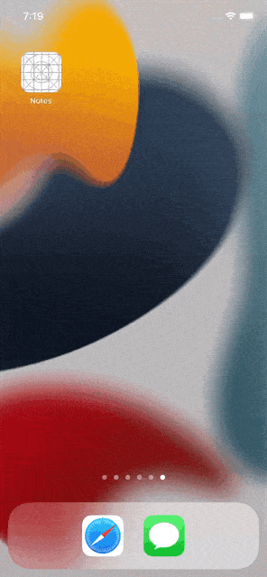
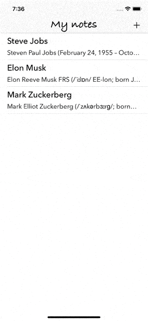
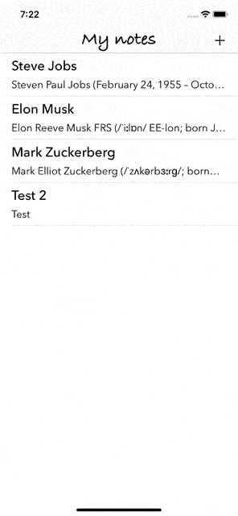

# Notes
Тестовое приложение - "Заметки"

## Технические характеристики приложения

* iOS 13+
* Swift 5
* UIKit full programmatically
* MVC
* Нет внешних зависимостей
* Хранение данных в CoreData

## Обзор экранов приложения

<table>
    <thead>
        <tr>
            <th>Основной экран</th>
            <th>Добавление заметки</th>
            <th>Редактирование</th>
        </tr>
    </thead>
    <tbody>
        <tr>
            <td>
                
            </td>
            <td>
                
            </td>
                        <td>
                
            </td>
        </tr>
    </tbody>
</table>
<table>
    <thead>
        <tr>
            <th>Удаление заметок</th>
        </tr>
    </thead>
    <tbody>
        <tr>
            <td>
                
            </td>
        </tr>
    </tbody>
</table>
<table>
    <thead>
        </tr>
    </tbody>
</table>
